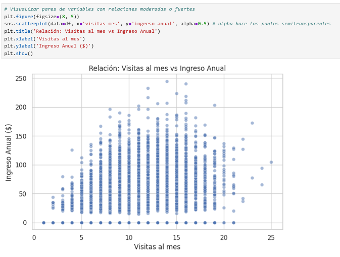
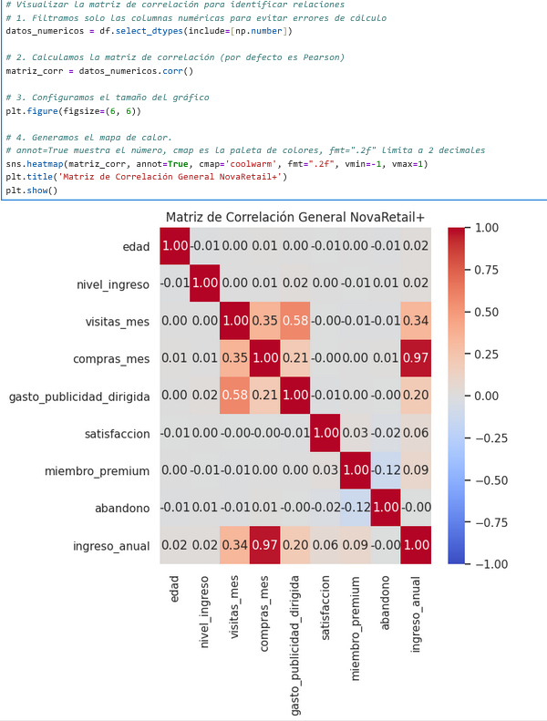

# 🛒 Análisis de Comportamiento de Clientes — NovaRetail+

> Análisis correlacional completo sobre los factores de comportamiento del cliente que más influyen en el ingreso anual generado para **NovaRetail+**, plataforma de comercio electrónico en Latinoamérica. Proyecto correspondiente al Sprint 8.

---

## 🎯 Objetivo del Proyecto

Responder la siguiente pregunta de negocio planteada por el equipo de **Crecimiento y Retención** para el cierre de 2024:

> **¿Qué factores del comportamiento del cliente están más fuertemente asociados con el ingreso anual generado?**

El análisis es de naturaleza **correlacional y exploratorio** — no establece causalidad. Los resultados están orientados a generar recomendaciones accionables para el equipo de negocio.

---

## 📂 Dataset Utilizado

| Archivo | Registros | Descripción |
|---|---|---|
| `novaretail_comportamiento_clientes_2024.csv` | 15,000 filas | Comportamiento de clientes durante 2024 |

### Columnas del dataset

| Columna | Tipo | Descripción |
|---|---|---|
| `id_cliente` | string | Identificador único del cliente |
| `edad` | numérico | Edad del cliente (rango: 18–75, media: 38 años) |
| `nivel_ingreso` | numérico | Ingreso anual estimado del cliente (~$30,019 media) |
| `visitas_mes` | numérico | Visitas a la app/web por mes (media: 10) |
| `compras_mes` | numérico | Compras realizadas por mes (mediana: 1) |
| `gasto_publicidad_dirigida` | numérico | Gasto en anuncios asignado al usuario |
| `satisfaccion` | numérico 1–5 | Calificación de satisfacción del cliente |
| `miembro_premium` | binario 0/1 | Suscripción premium activa |
| `abandono` | binario 0/1 | Si el cliente abandonó la plataforma |
| `tipo_dispositivo` | categórica | móvil / escritorio / tablet |
| `region` | categórica | norte / sur / oeste / este |
| `ingreso_anual` | numérico | **Variable objetivo** — ingreso anual generado para la empresa |

---

## 🔬 Etapas del Análisis

### Sección 1 — Carga y exploración inicial
- Importación de librerías: `pandas`, `numpy`, `matplotlib`, `seaborn`, `scipy.stats`.
- Carga del dataset (`15,000 registros × 12 columnas`) — **sin valores nulos**.
- Revisión de estructura con `.info()` y `.head()`.
- Estadísticas descriptivas con `.describe()`.

**Hallazgo clave:** El percentil 25 de `ingreso_anual` es `0.00`, lo que indica que al menos el **25% de los clientes registrados no genera ningún ingreso** para la plataforma.

---

### Sección 2 — Preparación de datos y supuestos

**Transformaciones aplicadas:**
- `id_cliente` → convertido a `string` para excluirlo de cálculos matemáticos.
- `tipo_dispositivo` y `region` → convertidas a tipo `category` para optimizar memoria.
- Variables binarias (`miembro_premium`, `abandono`) — ya codificadas en 0/1, sin transformación adicional.

**Diagnóstico de variables binarias:**
- `miembro_premium`: solo el **14% de los usuarios** (2,089) son premium; 12,911 operan en nivel gratuito.
- `abandono`: tasa de churn del **15%** (2,261 usuarios).

**Diagnóstico de variables categóricas:**
- `tipo_dispositivo`: **65%+ de usuarios usa móvil** (9,818 de 15,000). Clara señal de arquitectura *Mobile-First*.
- `region`: distribución relativamente balanceada — Norte lidera con 4,395 usuarios, Este con 3,069.

**Supuestos documentados:**
- Se usa Pearson para relaciones lineales entre numéricas.
- Se usa Spearman para relaciones monótonas o con outliers.
- Se usa Punto-biserial para numérica vs binaria.
- Se usa V de Cramér para categórica vs categórica.

---

### Sección 3 — Visualización de relaciones

**Heatmap — Matriz de correlación general:**
- La gran mayoría de variables numéricas tienen correlación débil o casi nula entre sí.
- Excepción: `compras_mes` muestra una correlación casi perfecta con `ingreso_anual` — relación visualmente sobresaliente en el heatmap.

**Scatterplots para pares clave:**

| Par analizado | Patrón observado |
|---|---|
| `compras_mes` vs `ingreso_anual` | Relación positiva casi perfecta, dispersión muy baja, alta colinealidad |
| `visitas_mes` vs `ingreso_anual` | Dirección indefinida, dispersión alta, sin colinealidad |

> Se descartó el pairplot general por overplotting con 15,000 registros y 7 variables numéricas.

---

### Sección 4 — Coeficientes de correlación

#### Pearson / Spearman

| Par | Pearson | Spearman | Interpretación |
|---|---|---|---|
| `compras_mes` vs `ingreso_anual` | **0.967** | **0.967** | Correlación casi perfecta — alta colinealidad |
| `visitas_mes` vs `ingreso_anual` | baja | baja | Sin relación matemática directa |

#### Punto-biserial

| Par | Coeficiente | Interpretación |
|---|---|---|
| `miembro_premium` vs `ingreso_anual` | **0.093** | Relación positiva pero muy débil |
| `abandono` vs `ingreso_anual` | negativo, bajo | Clientes con abandono asociados a menores ingresos |

#### V de Cramér

| Par | V de Cramér | Interpretación |
|---|---|---|
| `region` vs `tipo_dispositivo` | **0.000** | Ausencia total de asociación — el uso de móvil es igual en todas las regiones |

---

### Sección 5 — Interpretación para el negocio

#### 🔍 Hallazgo 1 — El ingreso viene de la compra, no de la visita
- **Evidencia:** Pearson de 0.967 entre `compras_mes` e `ingreso_anual`.
- **Interpretación:** El tráfico no se traduce automáticamente en ganancias. El ingreso está dictado casi en su totalidad por la conversión final.
- **Implicación:** El equipo de Crecimiento debe priorizar la optimización del embudo de conversión (checkout, recomendaciones personalizadas, cupones de primera compra) en lugar de solo generar tráfico. El **25% de la base jamás ha gastado dinero**.

#### 🔍 Hallazgo 2 — El programa Premium no está impulsando mayores ingresos
- **Evidencia:** Correlación Punto-biserial de 0.093 entre `miembro_premium` e `ingreso_anual`.
- **Interpretación:** Los clientes premium no gastan significativamente más que los usuarios estándar.
- **Implicación:** Revisar la propuesta de valor de la membresía Premium. Para 2025, agregar beneficios que incentiven la compra: envíos gratis sin mínimo, acceso anticipado a rebajas, sistema de puntos/cashback.

---

### Sección 6 — Limitaciones y próximos pasos

**Limitaciones:**
- Correlación ≠ causalidad: se identifican relaciones, no comportamientos causales.
- `compras_mes` e `ingreso_anual` son casi colineales, lo que eclipsa el análisis de factores sutiles.
- No hay datos de temporalidad o estacionalidad (Buen Fin, Navidad).

**Próximos pasos recomendados:**
- **Clusterización (K-Means):** Segmentar entre "Ballenas" (alto ingreso), "Cazadores de ofertas" y el 25% inactivo.
- **Machine Learning:** Entrenar un modelo de clasificación (Random Forest / Regresión Logística) para predecir churn (`abandono`) y actuar preventivamente.
- **Estrategia Mobile-First:** Con 9,800+ usuarios en móvil, ejecutar pruebas A/B en el carrito de compras para llevar la mediana de compras de 1 a 2 por mes.

---

## 📊 Visualizaciones





## ⚙️ Requisitos

```bash
pandas
numpy
matplotlib
seaborn
scipy
```

Instala las dependencias con:

```bash
pip install pandas numpy matplotlib seaborn scipy
```

---

## 🚀 Cómo Ejecutar el Notebook

### Opción A — Clonar el repositorio

```bash
git clone https://github.com/TU_USUARIO/TU_REPOSITORIO.git
cd TU_REPOSITORIO
jupyter notebook S8-Project-NovaRetail.ipynb
```

### Opción B — Descargar desde GitHub

1. Descarga el archivo `.ipynb` directamente desde GitHub (botón **Download raw file**).
2. Abre Jupyter Notebook o JupyterLab en tu máquina local.
3. Navega hasta la carpeta del archivo y ábrelo.

---

## 🗂️ Guía de Reproducción

1. **Clona o descarga** el repositorio.
2. **Coloca el dataset** en la raíz del proyecto:
   ```
   novaretail_comportamiento_clientes_2024.csv
   ```
3. **Ejecuta las celdas en orden** — Sección 1 → Sección 6. Cada sección depende de la anterior.
4. Al finalizar la Sección 2, se genera automáticamente:
   ```
   novaretail_clean.csv  ✅ OK — 911,602 bytes
   ```
5. El notebook genera las visualizaciones (heatmap y scatterplots) en la Sección 3 al ejecutarse.

---

## 📁 Estructura del Repositorio

```
📦 TU_REPOSITORIO
 ┣ 📂 png/
 ┃ ┣ heatmap_correlacion.png
 ┃ ┗ scatterplot_compras_ingreso.png
 ┣ 📂 datasets/
 ┃ ┣ 📄 novaretail.csv
 ┣ 📂 datasets_clean/
 ┃ ┣ 📄 novaretail_clean.csv
 ┣ 📓 S8-Project-NovaRetail.ipynb
 ┗ 📄 README.md
```

---

## 👤 Autor

Proyecto desarrollado como parte del Sprint 8 del programa de Análisis de Datos.
